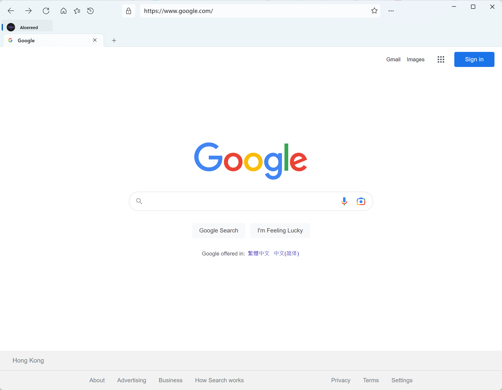
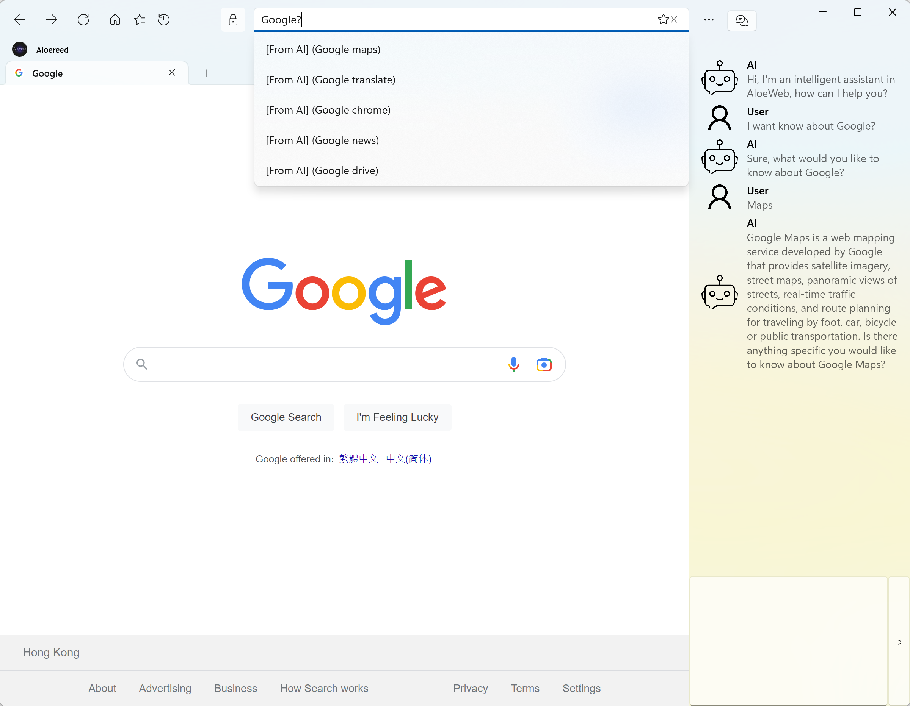
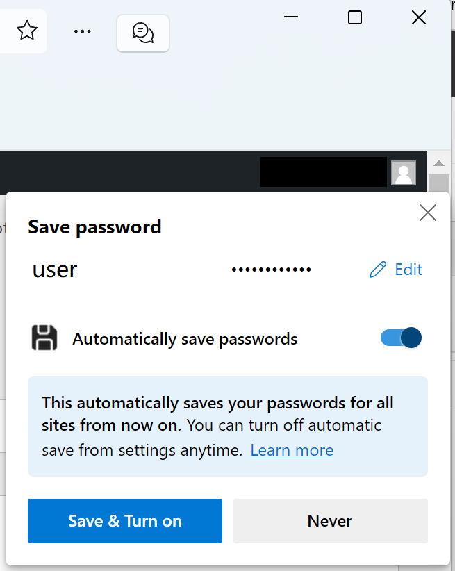
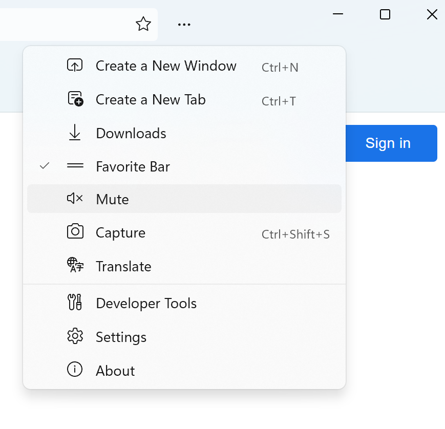
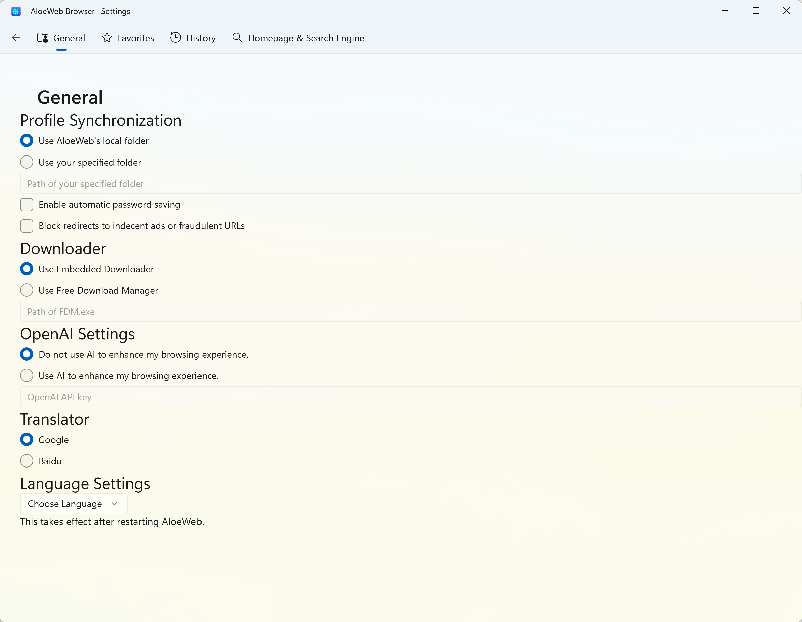

<!--
 * @Author: 
 * @Date: 2023-03-22 23:35:57
 * @LastEditors: Please set LastEditors
 * @LastEditTime: 2023-03-29 19:54:13
 * @Description: file content
-->
# AloeWeb
### AloeWeb is a AI-integrated UWP Web Browser (a **Yttrium** project), which is  with WinUI based on Edge WebView2 technology.

I need your help! When I submit to Microsoft Store, their testers consistently crash when the program starts. And I can't reproduce such problem in local development, debugging and deployment. Can an eager GitHuber take a look at what the problem is?

## Pictures

##  Old: How to install?
1. Install [Edge WebView2 Core ](https://developer.microsoft.com/en-us/microsoft-edge/webview2/consumer/)if you don't have it installed yet
2. Log in to GitHub
3. Go to Actions tab of the Yttrium repository
4. Choose branch on the left side (experimental branch is currently worked on)
5. Go to the latest workflow run with ✅ icon
6. Go to artifacts at the bottom of the page, you will see **yttrium artifact**, download it
7. Extract the artifact
8. Run Install.ps1 script (or you can install package and certificate manually)
9. Installed!

#### I am grateful for any contributions!
